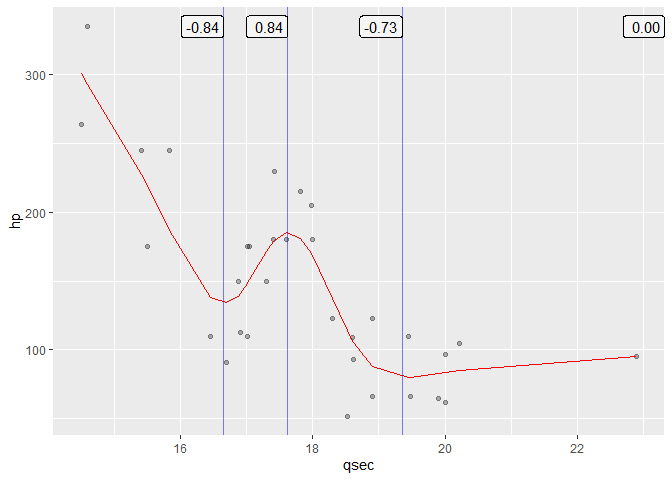
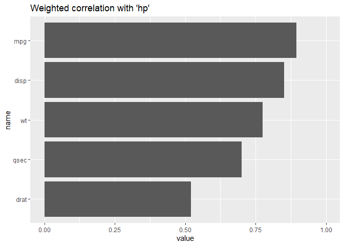

piececor
================

[](https://lifecycle.r-lib.org/articles/stages.html#experimental)

-   [Steps](#steps)
-   [Example](#example)
    -   [Correlations of segments](#correlations-of-segments)
    -   [Plots of splits](#plots-of-splits)
    -   [Weighted correlation](#weighted-correlation)
-   [Customizing](#customizing)
    -   [Smoother fit](#smoother-fit)
    -   [Correlation metric](#correlation-metric)
-   [Installation](#installation)
-   [Limitations & Notes](#limitations--notes)
-   [Resources](#resources)

<!-- README.md is generated from README.Rmd. Please edit that file -->
<!-- badges: start -->
<!-- badges: end -->

piececor is a toy package for calculating piecewise correlations of a
set of {*variables of interest*} with a {*target*} variable. This may be
useful for exploratory data analysis or in “simple filtering” of
features for predictive modeling.

This package is a *rough* mock-up of initial ideas discussed between
Bryan Shalloway, Dr. Shaina Race, and Ricky Tharrington.

# Steps

The core function is `piecewise_cors()` which, for each {*variable of
interest*}:

1.  Splits observations into segments based on the local minima / maxima
    of a smoother fit on *{target} \~ {variable of interest}*.
2.  Calculates the correlation between *{target} & {variable of
    interest}* for each segment
3.  Allows for calculating a weighted correlation coefficient across
    segments
4.  Repeat for all {*variables of interest*} with {*target*}

# Example

Use a version of `mtcars` data with some numeric columns converted to
factors.

``` r
library(tidyverse)
library(piececor)

min_unique_to_fact <- function(x, min_unique = 8){
  if( (length(unique(x)) < min_unique) & is.numeric(x) ){
    return(as.factor(x))
  } else x
}

mtcars_neat <- mtcars %>%
  as_tibble(rownames = "car") %>%
  mutate(across(where(is.numeric), min_unique_to_fact))
```

## Correlations of segments

Specify `data`, `.target`, and `...`[1]

``` r
mods_cors <- piecewise_cors(data = mtcars_neat,
                            .target = hp,
                            mpg, disp, drat, wt, qsec)
```

Note that [tidy
selectors](https://dplyr.tidyverse.org/reference/dplyr_tidy_select.html)
can be used in place of explicitly typing each *variable of interest*.
I.e. in the above example `mpg, disp, drat, wt, qsec`could be replaced
by `where(is.double)`.

`piecewise_cors()` returns a named list of `mods` and `cors`.

**Correlations:**

For each *variable of interest*, `cors` has a dataframe with information
on the domain (`gtoe` to `lt`) for each segment of observations
(`data`), the number of observations (`n_obs`) in the segment, and the
associated correlation (`cor`) of the variable with `.target`.

(`cors` dataframes with one row represent smoothed fits with no local
minima / maxima.)

``` r
mods_cors$cors
#> $mpg
#> # A tibble: 1 x 5
#>    gtoe    lt data              n_obs    cor
#>   <dbl> <dbl> <list>            <dbl>  <dbl>
#> 1  -Inf   Inf <tibble [32 x 2]>    32 -0.895
#> 
#> $disp
#> # A tibble: 1 x 5
#>    gtoe    lt data              n_obs   cor
#>   <dbl> <dbl> <list>            <dbl> <dbl>
#> 1  -Inf   Inf <tibble [32 x 2]>    32 0.851
#> 
#> $drat
#> # A tibble: 1 x 5
#>    gtoe    lt data              n_obs    cor
#>   <dbl> <dbl> <list>            <dbl>  <dbl>
#> 1  -Inf   Inf <tibble [32 x 2]>    32 -0.520
#> 
#> $wt
#> # A tibble: 1 x 5
#>    gtoe    lt data              n_obs   cor
#>   <dbl> <dbl> <list>            <dbl> <dbl>
#> 1  -Inf   Inf <tibble [32 x 2]>    32 0.775
#> 
#> $qsec
#> # A tibble: 4 x 5
#>     gtoe    lt data              n_obs    cor
#>    <dbl> <dbl> <list>            <int>  <dbl>
#> 1 -Inf    16.7 <tibble [6 x 2]>      6 -0.841
#> 2   16.7  17.6 <tibble [10 x 2]>    10  0.837
#> 3   17.6  19.4 <tibble [9 x 2]>      9 -0.727
#> 4   19.4 Inf   <tibble [7 x 2]>      7  0
```

By default `piecewise_cors()` uses Spearman’s Rank Correlation
Coefficient[2].

**Smoothing models:**

For each *variable of interest*, `mods` contains a
[parsnip](https://github.com/tidymodels/parsnip) fit object (the
smoothing model). The local minima / maxima of these fitted models
determines the breakpoints for segmenting observations for each
correlation calculation[3]. In our example, these may be accessed with
`mods_cors$mods`.

By default `mgcv::gam()` (via a parsnip interface) is the engine for the
smoother. At present, it is also the only model type that will work[4].

## Plots of splits

To review the split points, the outputs from `piecewise_cors()` can be
passed into `plot_splits()`. *Variables of interest* that you wish to
plot must be typed or specified by a tidy selector.

``` r
mods_cors %>% 
  plot_splits(mpg, qsec)
#> mpg: No splits, i.e. no local extrema in smoothed fit.
#> $mpg
```


    #> 
    #> $qsec



To view plots for all *variables of interest*, replace `mpg, qsec` with
`everything()`.

## Weighted correlation

The output from `piecewise_cors()` can be passed to the helper
`weighted_abs_mean_cors()` to calculate an overall weighted
“correlation” between 0 and 1 for each *variable of interest*.

``` r
weighted_cors <- weighted_abs_mean_cors(mods_cors)

weighted_cors
#> # A tibble: 5 x 2
#>   name  value
#>   <chr> <dbl>
#> 1 mpg   0.895
#> 2 disp  0.851
#> 3 drat  0.520
#> 4 wt    0.775
#> 5 qsec  0.700

weighted_cors %>% 
  mutate(name = forcats::fct_reorder(name, value)) %>% 
  ggplot(aes(y = name, x = value))+
  geom_col()+
  xlim(c(0, 1))+
  labs(title = "Weighted correlation with 'hp'")
```



By default a Fisher z-transformation is applied to the individual
correlations when calculating the weighted correlation. See
`?weighted_abs_mean_cors` for more information.

See the end of section [Correlation metric](#correlation-metric) for an
example calculating a p-value on piecewise correlations.

# Customizing

Arguments `custom_model_spec` and `fit_formula` can be used to customize
the [Smoother fit](#smoother-fit). `cor_function` allows for changes in
the [Correlation metric](#correlation-metric) calculated on the
segments. See `?piecewise_cors` for more detail on these arguments.

## Smoother fit

`custom_model_spec` can take in a parsnip model specifications[5]. For
example, setting `sp` (smoothing parameter) to `sp = 2` gives a smoother
fit to `hp ~ qsec` that no longer segments the observations:

``` r
mod_spec <- parsnip::gen_additive_mod() %>%
  parsnip::set_engine("mgcv", method = "REML", sp = 2) %>%
  parsnip::set_mode("regression")

mods_cors_custom <- 
  piecewise_cors(data = mtcars_neat,
                 .target = hp,
                 mpg, disp, drat, wt, qsec,
                 custom_model_spec = mod_spec)

mods_cors_custom %>% 
  plot_splits(qsec)
#> qsec: No splits, i.e. no local extrema in smoothed fit.
#> $qsec
```


Equivalently, this may be specified by passing the parameter into the
`fit_formula` argument:

``` r
# Chunk not evaluated
piecewise_cors(
  data = mtcars_neat,
  .target = hp,
  mpg, disp, drat, wt, qsec,
  fit_formula = ".target ~ s(..., sp = 2)"
)
```

See [Generalized additive models via
mgcv](https://parsnip.tidymodels.org/reference/details_gen_additive_mod_mgcv.html)
and associated reference pages for more details on parsnip interfaces.

## Correlation metric

Say you want to measure Pearson’s rather than Spearman’s correlation
coefficient on segments, you could use the `cor_function` argument to
change the lambda function:

``` r
piecewise_cors(
  data = mtcars_neat,
  .target = hp,
  mpg, disp, drat, wt, qsec,
  cor_function = "~cor(.x, method = 'pearson')[2,1]"
) %>%
  weighted_abs_mean_cors()
#> # A tibble: 5 x 2
#>   name  value
#>   <chr> <dbl>
#> 1 mpg   0.776
#> 2 disp  0.791
#> 3 drat  0.449
#> 4 wt    0.659
#> 5 qsec  0.718
```

You aren’t prevented from passing into `cor_function` lambda
functions[6] to calculate metrics/statistics other than correlations[7].

For example, say we want to see the p.value’s of Pearson correlations[8]
at each segment for `hp ~ qsec`:

``` r
# Warnings silenced in chunk output
mods_cors_pvalues <- 
  piecewise_cors(data = mtcars_neat,
                 .target = hp,
                 mpg, disp, drat, wt, qsec,
# cor.test() expects x and y vectors not a matrix or dataframe
                 cor_function = "~cor.test(.x[[1]], .x[[2]], method = 'pearson')$p.value"
  )

# let's check for qsec
mods_cors_pvalues$cors$qsec
#> # A tibble: 4 x 5
#>     gtoe    lt data              n_obs     cor
#>    <dbl> <dbl> <list>            <int>   <dbl>
#> 1 -Inf    16.7 <tibble [6 x 2]>      6 0.0394 
#> 2   16.7  17.6 <tibble [10 x 2]>    10 0.0156 
#> 3   17.6  19.4 <tibble [9 x 2]>      9 0.00489
#> 4   19.4 Inf   <tibble [7 x 2]>      7 0.660
```

The `cor` column here actually represents the statistical test (run
separately on each segment) of the null hypothesis that the correlation
coefficient is 0.

We could use Stouffer’s [Z-score
method](https://en.wikipedia.org/wiki/Fisher%27s_method#Relation_to_Stouffer's_Z-score_method)
to combine these into an overall p-value:

``` r
# combine_test() is (mostly) copied from {survcomp} package
mods_cors_pvalues$cors$qsec %>% 
  with(piececor:::combine_test(cor, n_obs, method = "z.transform"))
#> [1] 0.0006511026
```

# Installation

Install from github with:

``` r
devtools::install_github("brshallo/piececor")
```

# Limitations & Notes

-   Very slow compared to other common “simple filtering” methods for
    predictive modeling[9].
-   Trying on a few different datasets, it often does not pass the “eye
    test”.
    -   Splits often come near flatter parts of the data or at the tails
        of the distribution where there are fewer points
-   Output of `weighted_abs_mean_cors()` is not particularly meaningful
    in a traditional notion of “correlation.”
    -   Splits are determined based on optimizing a fit to a {*target*}
        – therefore flipping *{target} \~ {variable of interest}* to
        *{variable of interest} \~ {target}* produces different weighted
        correlation scores[10]. A smoother that was fit based on total
        least squares or minimizing orthogonal distance or some other
        approach may be more appropriate.
-   How to do weighted correlation metrics and associated p-values
    generally should be given a bit more thought.
    -   Other resources on “simple filtering” techniques (e.g. from
        [Feature Engineering and
        Selection…](http://www.feat.engineering/greedy-simple-filters.html))
        recommend converting scores of feature importance to some
        standardized metric, e.g. a p-value.  
-   There is extensive literature in predictive modeling on identifying
    *knots*. The experiment with this package is to take advantage of
    existing software that uses knots or other smoothing techniques and
    then instead to consider the local minima / maxima created by those
    techniques to inform cut-points. The defaults of “mgcv” hopes to
    prevent overfitting and the use of “Spearman’s” correlation means
    we’re checking whether the relationship is monotonic.
    -   However we haven’t done a ton of research on relevant literature
        concerning knots and other methods for determining cut-points.
    -   Right now the cut-points are essentially determined by looking
        where in the smoothed fits the first derivative == 0. We may
        want to consider critical points or other methods. We may also
        want to have some level of tolerance or requisite change in
        slope or observations in segment, etc. so that minor bumps don’t
        create multiple segments.
-   `custom_model_spec` allows a parsnip model specification, with the
    idea that this would facilitate the input of any kind of smoother
    supported by parsnip (e.g. MARS, polynomial regression, …). However
    actually implementing this would require the removal of the
    dependency on [gratia](https://gavinsimpson.github.io/gratia/) as
    well as multiple other changes to piececor.
-   More thought should go into the structure of the output of
    `piecewise_cors()`
-   (Almost) no checks, tests, catches, etc. have been set-up

# Resources

Links are copied from slack discussions[11] and may be only tangentially
related to piececor package.

-   [NNS](https://github.com/OVVO-Financial/NNS) Package for Nonlinear
    nonparametric statistics, related to kernel regression techniques
    (python package also available).
-   [ppsr](https://github.com/paulvanderlaken/ppsr) R implementation of
    predictive power score which outputs a normalized score of how well
    x predicts y (using a particular model specification and choice of
    performance metric) – python package is also available.
-   [ProcessMiner/nlcor](https://github.com/ProcessMiner/nlcor) package
    (non-linear correlation): <https://github.com/ProcessMiner/nlcor>
    -   nlcor uses Pearson correlation whereas piececor defaults to use
        Spearman, with the option of overriding this with `cor_function`
        argument
    -   nlcor uses adaptive local linear correlation computations to
        determine cut-points whereas piececor uses the local maxima /
        minima of a smoother defined by a {`parsnip`} model
        specification.
    -   nlcor currently does not apply any transformations when
        calculating ‘total adjusted’ correlations and associated
        p-values (see [github
        comment](https://github.com/ProcessMiner/nlcor/issues/15#issuecomment-928320054).
-   For tidy interface for measures of association also see
    [infer](https://github.com/tidymodels/infer),
    [corrr](https://corrr.tidymodels.org/),
    [easystats](https://github.com/easystats/easystats)
-   Just *slightly* tangential, there are a ton of non-linear projection
    methods out there, e.g. KPCA, UMAP, ICA, tSNE, and many others… many
    of these are accessible via recipes or embed packages in tidymodels
    ecosystem.
-   “Variable Importance Analysis: A Comprehensive review”
    <https://www.sciencedirect.com/science/article/abs/pii/S0951832015001672>
-   “Permutation importance: a corrected feature importance measure”
    <https://academic.oup.com/bioinformatics/article/26/10/1340/193348?login=true>
-   “A computationally fast variable importance test for random forests
    for high-dimensional data”
    <https://core.ac.uk/download/pdf/216462194.pdf>
-   ELI5 python package:
    <https://eli5.readthedocs.io/en/latest/overview.html#basic-usage>
-   “How To Assess Statistical Significance In Your Data with
    Permutation Tests”
    <https://towardsdatascience.com/how-to-assess-statistical-significance-in-your-data-with-permutation-tests-8bb925b2113d>
-   “Interpretable Machine Learning”
    <https://christophm.github.io/interpretable-ml-book/>
-   Getting derivitives from GAM’s
    -   <https://gavinsimpson.github.io/gratia/reference/fderiv.html>
    -   <https://stackoverflow.com/questions/14207250/determining-derivatives-from-gam-smooth-object>
-   Covariant Derivatives
    <https://en.wikipedia.org/wiki/Covariant_derivative>
-   “Efficient test for nonlinear dependence of two continuous
    variables”
    <https://bmcbioinformatics.biomedcentral.com/articles/10.1186/s12859-015-0697-7>
-   11.2 Simple Filters, from Feature Engineering and Selection…
    <http://www.feat.engineering/greedy-simple-filters.html>
-   Fisher transformation
    <https://en.wikipedia.org/wiki/Fisher_transformation>
-   Parsnip package documentation on generalized additive models:
    <https://parsnip.tidymodels.org/reference/details_gen_additive_mod_mgcv.html>

[1] *variables of interest* are represented by `...` in the function.

[2] So is measuring the extent to which the relationship is monotonic.

[3] `mods` is primarily saved simply for use with
`piececor::plot_splits()`.

[4] In theory, with some changes, other model types with parsnip
interfaces could be added with minimal effort

[5] Again only generative additive models via the “mgcv” engine may be
specified. This is in large part due to a dependency on the deprecated
`fderiv()` function in [gratia](https://gavinsimpson.github.io/gratia/).
Though changes would also need to be made to the `fit_formula` argument
in `piececor::piecewise_cors()` to accommodate this. Other non-linear,
continuous models would be possible candidates, e.g. loess or
multi-adaptive regression splines (which also already has a parsnip
interface).

[6] \*Character strings of tidyverse shortcut syntax for lambda
functions.

[7] Provided the lambda function evaluates to a numeric vector of length
1

[8] Used Pearson rather than Spearman in this example because Spearman
can more easily get odd cases where end-up with p-values of 1, which
happens in this case, and break common methods for combining p-values

[9] Given that for each *variable of interest* an `mgcv` model is fit –
along with various other steps.

[10] Correlation measures usually don’t have some notion of a target, so
the measures would be the same.

[11] And not properly cited
